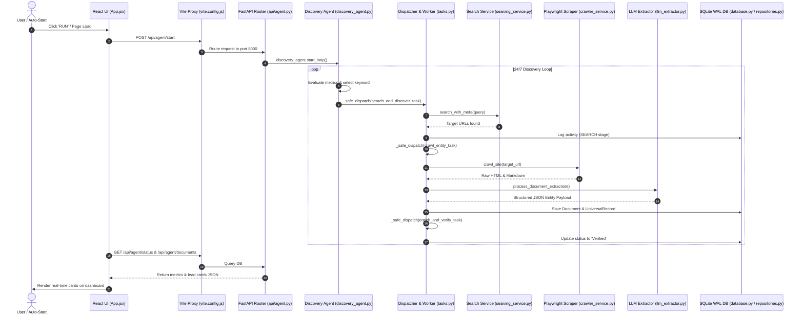

# OpenDB End-to-End Code Execution Walkthrough (Input to Output)

This document provides an exhaustive code-level explanation of how input data flows through the OpenDB architecture to produce structured, verified lead cards on the frontend dashboard.

---

## 🗺️ Architectural Code Flow Overview



---

## 1. Input Stage: Form Submission & Start Trigger

### 📁 Code File: `frontend/src/App.jsx`
The workflow begins when the user loads the dashboard or clicks **RUN AGENT** in the UI header.

```javascript
// frontend/src/App.jsx (Lines 110–125)
const handleStartAgent = async () => {
  try {
    const res = await fetch(`${API_BASE}/agent/start`, { method: 'POST' });
    if (res.ok) {
      setAgentStatus(prev => ({ ...prev, status: 'RUNNING', is_loop_running: true }));
    }
  } catch (err) {
    console.error("Failed to start agent:", err);
  }
};
```

- **Role**: Dispatches an HTTP `POST` request to `/api/agent/start` to wake up the 24/7 discovery agent loop.

---

## 2. Proxy & Routing Stage: Delegation to FastAPI Backend

### 📁 Code File: `frontend/vite.config.js`
The Vite development web server intercepts `/api` calls on port `5173` and proxies them to port `8000`.

```javascript
// frontend/vite.config.js (Lines 8–15)
export default defineConfig({
  plugins: [react()],
  server: {
    port: 5173,
    proxy: {
      '/api': {
        target: 'http://127.0.0.1:8000',
        changeOrigin: true,
      }
    }
  }
})
```

### 📁 Code File: `backend/app/api/agent.py`
FastAPI routes the incoming request to the `/start` handler:

```python
# backend/app/api/agent.py (Lines 160–165)
@router.post("/start")
def start_agent():
    """Start or resume the continuous 24/7 discovery agent loop."""
    discovery_agent.start_loop()
    return {"status": "started", "is_running": discovery_agent.is_running_loop}
```

---

## 3. Autonomous Agent Loop & Decision Making

### 📁 Code File: `backend/app/agent/discovery_agent.py`
`DiscoveryAgent` manages a continuous background loop (`_discovery_loop`) running every 4 seconds.

```python
# backend/app/agent/discovery_agent.py (Lines 175–238)
async def _discovery_loop(self):
    while self.is_running_loop:
        db = SessionLocal()
        try:
            state = self._get_or_create_state(db)
            if state.status != "RUNNING":
                db.close() # Lock prevention
                await asyncio.sleep(3)
                continue

            batch = self._get_or_create_batch(db, state)
            metrics = self.get_metrics(db)
            prompt = self._build_agent_prompt(metrics, batch)
            
            # Invoke LLM or Keyword Expander for next strategy
            query_info = keyword_expander.get_next_query(domain=state.current_domain)
            
            # Update active state targets
            state.current_domain = query_info["domain"]
            state.current_keyword = query_info["keyword"]
            db.commit()

            # Dispatch search task to background worker
            await asyncio.to_thread(
                self._dispatch_search_task,
                query=query_info["query"],
                keyword=query_info["keyword"],
                domain=query_info["domain"],
                subdomain=query_info["subdomain"],
                batch_id=str(batch.id)
            )
        finally:
            db.close()

        await asyncio.sleep(4)
```

- **Role**: Evaluates system state, updates target keywords, and hands off execution tasks to the worker dispatcher.

---

## 4. Web Search Query Execution

### 📁 Code File: `backend/app/crawler/searxng_service.py`
The search service fetches web URLs matching the generated query string.

```python
# backend/app/crawler/searxng_service.py (Lines 45–70)
async def search_with_meta(self, query: str, max_results: int = 20):
    """Executes live web search via SearXNG with fallback to DuckDuckGo."""
    try:
        results = await self._search_searxng(query, max_results)
        if results:
            return results, False, "SearXNG active"
    except Exception:
        pass
    
    # Live DuckDuckGo fallback
    results = await self._search_duckduckgo(query, max_results)
    return results, True, "Live DuckDuckGo active"
```

---

## 5. Task Dispatcher & Background Worker Isolation

### 📁 Code File: `backend/app/worker/tasks.py`
The `_safe_dispatch()` system routes tasks to Celery if available, or to isolated background daemon threads if running locally.

```python
# backend/app/worker/tasks.py (Lines 62–85)
def _safe_dispatch(task_func, *args, **kwargs):
    """Fault-tolerant dispatcher routing to Celery or background daemon threads."""
    if _has_active_celery_worker():
        task_func.delay(*args, **kwargs)
    else:
        t = threading.Thread(target=task_func, args=args, kwargs=kwargs, daemon=True)
        t.start()
```

- **Task 1 (`search_and_discover_task`)**: Evaluates search URLs and dispatches `crawl_entity_task` for each discovered target URL.

---

## 6. Deep Web Crawling & Content Storage

### 📁 Code File: `backend/app/worker/tasks.py` (`crawl_entity_task`)
Crawls the target URL outside of database transactions so that SQLite database locks are never held during web crawling.

```python
# backend/app/worker/tasks.py (Lines 378–425)
# Stage 0: Persist initial Document Record
db = SessionLocal()
try:
    doc = repo.create_document(db=db, url=url, title=derived_title)
    db.commit()
    doc_id = doc.id
finally:
    db.close() # Close DB session BEFORE launching web crawler!

# Stage 1: Crawl homepage using Playwright (No DB lock held)
crawled_items = run_async(
    crawler_service.crawl_site(starting_url=url, max_depth=2, max_pages=5)
)
```

### 📁 Code File: `backend/app/storage/file_storage.py`
Persists SHA-256 raw HTML, Markdown, and plain-text files into content-addressable storage:

```python
# backend/app/storage/file_storage.py (Lines 25–40)
def save_raw_page(self, html_content: str) -> Tuple[str, str]:
    content_hash = hashlib.sha256(html_content.encode('utf-8')).hexdigest()
    file_path = os.path.join(self.raw_pages_dir, f"{content_hash}.html")
    with open(file_path, "w", encoding="utf-8") as f:
        f.write(html_content)
    return content_hash, f"raw/pages/{content_hash}.html"
```

---

## 7. Quality Filtering Stage

### 📁 Code File: `backend/app/classification/quality_filter.py`
Ensures low-quality content, thin text pages, adult sites, and invalid URLs are rejected before schema extraction.

```python
# backend/app/classification/quality_filter.py (Lines 35–60)
def filter_content(self, url: str, html_content: str, text_content: str, title: str, word_count: int):
    if word_count < 30:
        return False, "Thin content (word count < 30)"
    if any(pattern in url.lower() for pattern in JUNK_URL_PATTERNS):
        return False, "Url pattern matched junk filter"
    return True, "Passed content quality check"
```

---

## 8. Structured Extraction & Verification Stage

### 📁 Code File: `backend/app/extraction/llm_extractor.py` & `extraction_pipeline.py`
Converts raw web page text into structured JSON domain schema fields using LiteLLM/Qwen 2.5 or rule heuristics:

```python
# backend/app/extraction/llm_extractor.py (Lines 60–90)
async def extract_domain_data(self, text_content: str, domain_name: str) -> Dict[str, Any]:
    schema = schema_registry.get_domain_schema(domain_name)
    # Extracts company_name, employee_count, industry, country, company_tier
    extracted_payload = self._run_llm_or_heuristic(text_content, schema)
    return extracted_payload
```

Once extracted, Worker C (`enrich_and_verify_task`) validates the record's confidence score and marks its status as **Verified**.

---

## 9. Thread-Safe Relational Persistence

### 📁 Code File: `backend/app/persistence/database.py` & `repositories.py`
Saves the document, universal record, extracted facts, and activity logs to PostgreSQL or thread-safe SQLite WAL storage.

```python
# backend/app/persistence/database.py (Lines 80–92)
# SQLite WAL Mode Configuration
eng = create_engine("sqlite:///./opendb_fallback.db", connect_args={"check_same_thread": False})
with eng.connect() as conn:
    conn.execute(text("PRAGMA journal_mode=WAL;"))
    conn.execute(text("PRAGMA busy_timeout=30000;"))
```

```python
# backend/app/persistence/repositories.py (Lines 150–180)
univ_rec = UniversalRecord(
    document_id=doc_id,
    canonical_name=company_name,
    entity_type=industry,
    country=country,
    status="Verified"
)
db.add(univ_rec)
db.commit()
```

---

## 10. Output Stage: REST API Delivery & React UI Rendering

### 📁 Code File: `backend/app/api/agent.py`
Exposes the persisted document lead cards and system metrics to the frontend UI via `GET /api/agent/documents`.

```python
# backend/app/api/agent.py (Lines 350–395)
@router.get("/documents")
def get_crawled_documents(page: int = 1, limit: int = 24, db: Session = Depends(get_db)):
    q = db.query(Document).order_by(Document.created_at.desc())
    docs = q.offset((page - 1) * limit).limit(limit).all()
    
    results = []
    for d in docs:
        results.append({
            "id": d.id,
            "url": d.url,
            "domain": _parse_url(d.url)[1],
            "canonical_name": d.title,
            "status": "Verified" if d.universal_records else "Raw Ingested",
            "crawled_at": d.created_at.isoformat()
        })
    return {"total": q.count(), "page": page, "results": results}
```

### 📁 Code File: `frontend/src/App.jsx`
The React UI polls `/api/agent/status` and `/api/agent/documents` every 3 seconds to re-render the stat cards, table rows, and activity log stream without page reloads.

```javascript
// frontend/src/App.jsx (Lines 55–80)
useEffect(() => {
  const pollInterval = setInterval(async () => {
    const [statusRes, docsRes] = await Promise.all([
      fetch(`${API_BASE}/agent/status`).then(r => r.json()),
      fetch(`${API_BASE}/agent/documents?page=1&limit=24`).then(r => r.json())
    ]);
    setAgentStatus(statusRes);
    setDocuments(docsRes.results);
  }, 3000);
  return () => clearInterval(pollInterval);
}, []);
```

---

## 📊 Summary Mapping: Input to Output

| Pipeline Stage | Input Artifact | Responsible Code File(s) | Output Result |
| :--- | :--- | :--- | :--- |
| **1. Trigger** | User Click / Auto-Start | [`App.jsx`](file:///e:/crawl/frontend/src/App.jsx) | `POST /api/agent/start` payload |
| **2. Routing** | `/api/agent/*` HTTP Request | [`vite.config.js`](file:///e:/crawl/frontend/vite.config.js), [`agent.py`](file:///e:/crawl/backend/app/api/agent.py) | Internal Python function call |
| **3. Agent Strategy** | System Metrics & State | [`discovery_agent.py`](file:///e:/crawl/backend/app/agent/discovery_agent.py) | Next keyword & domain target |
| **4. Web Search** | Search Query string | [`searxng_service.py`](file:///e:/crawl/backend/app/crawler/searxng_service.py) | List of raw company URLs |
| **5. Task Scheduling**| Unhandled target URLs | [`tasks.py`](file:///e:/crawl/backend/app/worker/tasks.py) (`_safe_dispatch`) | Async worker task thread |
| **6. Web Crawling** | Target URL | [`crawler_service.py`](file:///e:/crawl/backend/app/crawler/crawler_service.py) | Raw HTML, MD, & text files |
| **7. Content Filter** | Raw page text | [`quality_filter.py`](file:///e:/crawl/backend/app/classification/quality_filter.py) | Quality pass/reject signal |
| **8. Extraction** | Clean markdown text | [`llm_extractor.py`](file:///e:/crawl/backend/app/extraction/llm_extractor.py) | Structured entity JSON payload |
| **9. Persistence** | JSON payload & Document | [`database.py`](file:///e:/crawl/backend/app/persistence/database.py), [`repositories.py`](file:///e:/crawl/backend/app/persistence/repositories.py) | `Document` & `UniversalRecord` DB rows |
| **10. UI Delivery** | DB rows | [`agent.py`](file:///e:/crawl/backend/app/api/agent.py), [`App.jsx`](file:///e:/crawl/frontend/src/App.jsx) | Live lead cards rendered on UI |
