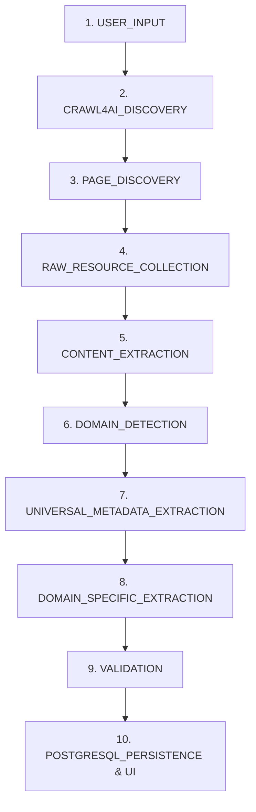

# OpenDB Step-by-Step Code-Level Pipeline Walkthrough

This document provides a comprehensive, code-level breakdown of the OpenDB ingestion engine—from user input submission on the React dashboard to PostgreSQL relational persistence and UI visualization across all **10 Pipeline Stages**.

---



---

## Stage 1: USER_INPUT (Form Submission & API Dispatch)

### Code Location
- **Frontend**: [`frontend/src/App.jsx`](file:///e:/crawl/frontend/src/App.jsx#L140-L218)
- **Backend API**: [`backend/app/api/crawl.py`](file:///e:/crawl/backend/app/api/crawl.py#L170-L199)

### Mechanism & Code Execution
1. The user fills in optional parameters on the React UI:
   - `Starting URL`: Optional URL (e.g. `https://news.ycombinator.com`). If blank, the system falls back to a default seed based on the chosen domain.
   - `Query / Requirement`: Optional natural language search string.
   - `Domain Schema`: Chosen from `Technology`, `Healthcare`, `Education`, `Business`.

2. The frontend triggers `handleStartCrawl` and sends a `POST` request to `/api/crawl`:

```javascript
// frontend/src/App.jsx
const response = await fetch('http://localhost:8000/api/crawl', {
  method: 'POST',
  headers: { 'Content-Type': 'application/json' },
  body: JSON.stringify({ url, query, domain })
});
```

3. The FastAPI router accepts `CrawlRequest` and initializes a `CrawlJob` in PostgreSQL with status `"pending"`, then dispatches `execute_crawl_pipeline` to a background task:

```python
# backend/app/api/crawl.py
@router.post("")
def start_crawl_job(request: CrawlRequest, background_tasks: BackgroundTasks, db: Session = Depends(get_db)):
    target_domain = request.domain or "Technology"
    raw_url = request.url.strip() if request.url and request.url.strip() else None

    # Fallback to default domain seed if starting URL is blank
    if not raw_url:
        raw_url = DOMAIN_DEFAULT_SEEDS.get(target_domain, "https://news.ycombinator.com")

    norm_url = normalizer.normalize_url(raw_url)
    job = repo.create_crawl_job(db=db, starting_url=norm_url, query=request.query, domain_name=target_domain)
    
    background_tasks.add_task(execute_crawl_pipeline, job.id, req_data)
    return {"job_id": job.id, "status": job.status}
```

---

## Stage 2: CRAWL4AI_DISCOVERY (URL Normalization & Seed Verification)

### Code Location
- **Normalizer**: [`backend/app/normalization/normalizer.py`](file:///e:/crawl/backend/app/normalization/normalizer.py#L18-L45)
- **URL Discovery**: [`backend/app/crawler/url_discovery.py`](file:///e:/crawl/backend/app/crawler/url_discovery.py#L12-L35)

### Mechanism & Code Execution
Before launching the browser, the starting URL is parsed, de-fragmented, stripped of tracking parameters, and validated:

```python
# backend/app/normalization/normalizer.py
def normalize_url(self, raw_url: str, base_url: Optional[str] = None) -> Optional[str]:
    # Resolve relative links against base_url
    if base_url:
        raw_url = urljoin(base_url, raw_url)
    
    parsed = urlparse(raw_url)
    # Strip URL fragments (#section) and tracking query params (utm_source, etc.)
    clean_query = urlencode([(k, v) for k, v in parse_qsl(parsed.query) if not k.startswith("utm_")])
    return urlunparse((parsed.scheme.lower(), parsed.netloc.lower(), parsed.path.rstrip('/'), '', clean_query, ''))
```

---

## Stage 3: PAGE_DISCOVERY (Async BFS Browser Crawling)

### Code Location
- **Crawler Service**: [`backend/app/crawler/crawler_service.py`](file:///e:/crawl/backend/app/crawler/crawler_service.py#L50-L166)
- **Proactor Event Loop Runner**: [`backend/app/api/crawl.py`](file:///e:/crawl/backend/app/api/crawl.py#L40-L60)

### Mechanism & Code Execution
1. To bypass Windows `SelectorEventLoop` limitations (`NotImplementedError`), the background task executes `CrawlerService.crawl_site()` inside a dedicated `ProactorEventLoop` worker thread:

```python
# backend/app/api/crawl.py
async def run_in_proactor_loop(async_fn: Callable, *args: Any, **kwargs: Any) -> Any:
    def worker():
        if sys.platform == "win32":
            loop = asyncio.WindowsProactorEventLoopPolicy().new_event_loop()
        else:
            loop = asyncio.new_event_loop()
        asyncio.set_event_loop(loop)
        return loop.run_until_complete(async_fn(*args, **kwargs))
    return await asyncio.to_thread(worker)
```

2. `AsyncWebCrawler` from `Crawl4AI` renders the page, executes JavaScript, extracts raw HTML, markdown, links, and media:

```python
# backend/app/crawler/crawler_service.py
async with AsyncWebCrawler(verbose=False) as crawler:
    crawl_res = await crawler.arun(url=curr_url, config=config)
    soup = BeautifulSoup(crawl_res.html, "lxml")
    title = normalizer.normalize_string(soup.title.string) if soup.title else curr_url
```

---

## Stage 4: RAW_RESOURCE_COLLECTION (File & Non-HTML Asset Ingestion)

### Code Location
- **Resource Discovery**: [`backend/app/crawler/resource_discovery.py`](file:///e:/crawl/backend/app/crawler/resource_discovery.py#L18-L107)
- **File Storage**: [`backend/app/storage/file_storage.py`](file:///e:/crawl/backend/app/storage/file_storage.py#L45-L70)

### Mechanism & Code Execution
1. As pages are crawled, `ResourceDiscoveryService` scans `<a>`, ``, and `<link>` elements for non-HTML files (PDF, CSV, JSON, TXT, XML, Images).
2. Downloadable file resources under the size limit (10MB) are fetched via `httpx.AsyncClient` and saved into content-addressable storage (`data/raw/documents/{sha256}.ext`):

```python
# backend/app/crawler/resource_discovery.py
res_type, mime_type, ext = cls.classify_resource(res_url)
if res_type == "document" or ext in {".pdf", ".txt", ".json", ".csv", ".xml"}:
    get_resp = await client.get(res_url)
    res_hash, rel_path = file_storage.save_raw_document(get_resp.content, ext=ext)
```

---

## Stage 5: CONTENT_EXTRACTION (SHA-256 Content Storage)

### Code Location
- **File Storage**: [`backend/app/storage/file_storage.py`](file:///e:/crawl/backend/app/storage/file_storage.py#L20-L44)

### Mechanism & Code Execution
The raw HTML content of every crawled webpage is hashed using SHA-256 and stored on disk. Derived Markdown and plain-text versions are generated and stored alongside:

```python
# backend/app/storage/file_storage.py
def save_raw_page(self, html_content: str) -> Tuple[str, str]:
    content_hash = hashlib.sha256(html_content.encode('utf-8')).hexdigest()
    file_path = os.path.join(self.raw_pages_dir, f"{content_hash}.html")
    with open(file_path, "w", encoding="utf-8") as f:
        f.write(html_content)
    return content_hash, relative_path
```

---

## Stage 6: DOMAIN_DETECTION (Automated Classification)

### Code Location
- **Classifier**: [`backend/app/classification/domain_classifier.py`](file:///e:/crawl/backend/app/classification/domain_classifier.py#L10-L48)

### Mechanism & Code Execution
The `DomainClassifier` evaluates keyword frequency signals across text content and meta tags to classify the page into target domains (`Technology`, `Healthcare`, `Education`, `Business`):

```python
# backend/app/classification/domain_classifier.py
def classify_text(self, text: str, user_domain: Optional[str] = None) -> Tuple[str, str, float]:
    scores = {domain: 0 for domain in self.domain_keywords}
    text_lower = text.lower()
    for domain, keywords in self.domain_keywords.items():
        for kw in keywords:
            scores[domain] += text_lower.count(kw)
    
    best_domain = max(scores, key=scores.get)
    confidence = min(0.95, 0.50 + (scores[best_domain] * 0.05))
    return best_domain, "General", confidence
```

---

## Stage 7: UNIVERSAL_METADATA_EXTRACTION (Deterministic Extraction)

### Code Location
- **CSS Extractor**: [`backend/app/extraction/css_extractor.py`](file:///e:/crawl/backend/app/extraction/css_extractor.py#L10-L55)

### Mechanism & Code Execution
Before involving an LLM, fast deterministic CSS selectors parse structural HTML elements (`<title>`, `<meta name="description">`, `<meta property="og:...">`, `<script type="application/ld+json">`, `<h1>`):

```python
# backend/app/extraction/css_extractor.py
def extract_universal_metadata(self, html_content: str, url: str) -> Dict[str, Any]:
    soup = BeautifulSoup(html_content, "lxml")
    title = soup.title.string.strip() if soup.title else ""
    meta_desc = soup.find("meta", attrs={"name": "description"})
    desc_content = meta_desc["content"].strip() if meta_desc and "content" in meta_desc.attrs else ""
    return { "title": title, "description": desc_content, "url": url }
```

---

## Stage 8: DOMAIN_SPECIFIC_EXTRACTION (Hybrid Semantic LLM / Heuristic Engine)

### Code Location
- **LLM Extractor**: [`backend/app/extraction/llm_extractor.py`](file:///e:/crawl/backend/app/extraction/llm_extractor.py#L15-L125)

### Mechanism & Code Execution
1. The extraction service loads the target domain JSON schema from `SchemaRegistry`.
2. If an `OPENAI_API_KEY` is present, it uses LiteLLM to extract structured JSON matching the schema.
3. If offline/no API key, robust heuristic rule-matching extracts values from text snippets.
4. **Strict Null Rule**: Any schema property not explicitly found in the source content is returned as `null` or `[]` (never hallucinated):

```python
# backend/app/extraction/llm_extractor.py
async def extract_domain_data(self, text_content: str, domain_name: str) -> Dict[str, Any]:
    schema = schema_registry.get_domain_schema(domain_name)
    # Heuristic fallback matching for offline execution
    extracted = {}
    for prop_name, prop_spec in schema.get("properties", {}).items():
        val = self._extract_heuristic_property(text_content, prop_name, prop_spec["type"])
        extracted[prop_name] = val # returns exact value or None / []
    return extracted
```

---

## Stage 9: VALIDATION (Schema Compliance & Evidence Snippet Linking)

### Code Location
- **Pipeline Orchestrator**: [`backend/app/extraction/extractor.py`](file:///e:/crawl/backend/app/extraction/extractor.py#L30-L90)

### Mechanism & Code Execution
1. The extracted domain payload is validated against the domain's JSON schema definitions via `jsonschema.validate()`.
2. For every populated field, exact text snippets are located within the raw page text to build verifiable **Evidence & Provenance** records:

```python
# backend/app/extraction/extractor.py
evidence_items = []
for k, v in domain_data.items():
    if v is not None and v != []:
        snippet = self._find_text_snippet(text_content, str(v))
        evidence_items.append({
            "field": k,
            "value": v,
            "text_snippet": snippet or f"Extracted value: {v}",
            "confidence": 0.92
        })
```

---

## Stage 10: POSTGRESQL_PERSISTENCE & REAL-TIME UI VISUALIZATION

### Code Location
- **Repositories**: [`backend/app/persistence/repositories.py`](file:///e:/crawl/backend/app/persistence/repositories.py#L144-L215)
- **Frontend UI Polling**: [`frontend/src/App.jsx`](file:///e:/crawl/frontend/src/App.jsx#L45-L100)

### Mechanism & Code Execution
1. **Database Storage**: The pipeline saves records in a single database transaction across relational tables (`documents`, `universal_records`, `domain_records`, `extracted_facts`, `evidence`):

```python
# backend/app/persistence/repositories.py
univ_rec = UniversalRecord(document_id=doc_id, domain_id=domain_obj.id, title=title, entity_type=entity_type)
db.add(univ_rec)

dom_rec = DomainRecord(universal_record_id=univ_rec.id, schema_version="1.0.0", data=domain_data)
db.add(dom_rec)

for k, v in domain_data.items():
    fact = ExtractedFact(document_id=doc_id, universal_record_id=univ_rec.id, field_name=k, field_value=str(v))
    db.add(fact)
    db.commit()
```

2. **Real-time UI Visualizer**: The React app polls `GET /api/crawl/{job_id}` every 1,500ms to update the 10-stage pipeline progress bar, summary cards, and result tables:

```javascript
// frontend/src/App.jsx
useEffect(() => {
  if (!jobId) return;
  const interval = setInterval(async () => {
    const res = await fetch(`http://localhost:8000/api/crawl/${jobId}`);
    const data = await res.json();
    setJobStatus(data);
    if (data.status === 'completed') clearInterval(interval);
  }, 1500);
  return () => clearInterval(interval);
}, [jobId]);
```

---

## Summary of Code Files & Responsibilities

| Stage | Responsibility | Primary File(s) |
| :--- | :--- | :--- |
| **1. USER_INPUT** | Form submission & Async Job Creation | [`App.jsx`](file:///e:/crawl/frontend/src/App.jsx), [`api/crawl.py`](file:///e:/crawl/backend/app/api/crawl.py) |
| **2. CRAWL4AI_DISCOVERY** | URL normalization & URL filtering | [`normalizer.py`](file:///e:/crawl/backend/app/normalization/normalizer.py), [`url_discovery.py`](file:///e:/crawl/backend/app/crawler/url_discovery.py) |
| **3. PAGE_DISCOVERY** | Playwright/Crawl4AI BFS page rendering | [`crawler_service.py`](file:///e:/crawl/backend/app/crawler/crawler_service.py) |
| **4. RAW_RESOURCE_COLLECTION** | Non-HTML file downloading (PDF/CSV) | [`resource_discovery.py`](file:///e:/crawl/backend/app/crawler/resource_discovery.py) |
| **5. CONTENT_EXTRACTION** | Content storage (SHA-256 hash files) | [`file_storage.py`](file:///e:/crawl/backend/app/storage/file_storage.py) |
| **6. DOMAIN_DETECTION** | Rule & signal keyword classification | [`domain_classifier.py`](file:///e:/crawl/backend/app/classification/domain_classifier.py) |
| **7. UNIVERSAL_METADATA** | Structural HTML tag & metadata parsing | [`css_extractor.py`](file:///e:/crawl/backend/app/extraction/css_extractor.py) |
| **8. DOMAIN_SPECIFIC_EXTRACTION**| LiteLLM / Rule hybrid extraction | [`llm_extractor.py`](file:///e:/crawl/backend/app/extraction/llm_extractor.py) |
| **9. VALIDATION** | Schema validation & evidence snippet matching | [`extractor.py`](file:///e:/crawl/backend/app/extraction/extractor.py) |
| **10. POSTGRESQL & UI** | Transactional ORM persistence & live React UI | [`repositories.py`](file:///e:/crawl/backend/app/persistence/repositories.py), [`App.jsx`](file:///e:/crawl/frontend/src/App.jsx) |
