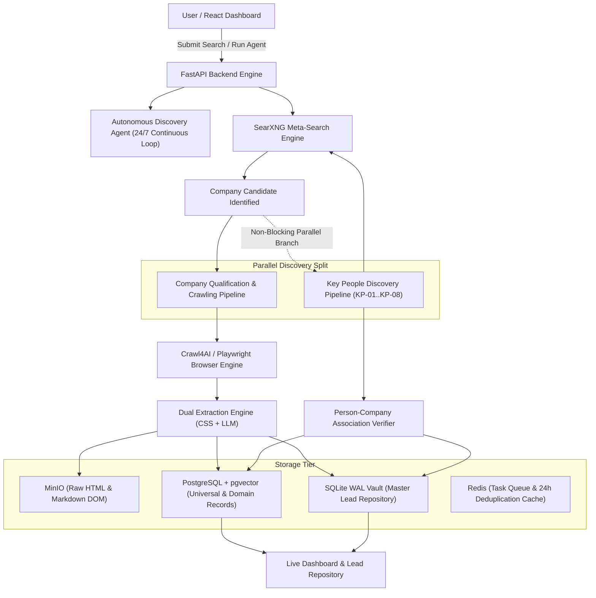

# OpenDB System Architecture — Executive Manager Overview

This document provides a concise, non-code-heavy technical architecture summary of the **OpenDB** Web Crawling & Ingestion Engine. It explains how OpenDB operates end-to-end—from initial user input or continuous agent search to company candidate qualification, official domain resolution, web crawling, key people discovery, storage, and live dashboard visualization.

---

## 1. What is OpenDB?

**OpenDB** is an autonomous, domain-aware web crawling and entity ingestion engine. It discovers publicly available web information about companies, extracts structured records (firmographics, technology stack, leadership, contact details), normalizes facts, tracks source provenance/evidence, and builds high-quality, verified company dossiers stored in PostgreSQL and an SQLite WAL Vault.

---

## 2. High-Level Architecture Diagram

---

## 3. Executive Q&A: How OpenDB Operates

### Q1: How does a company enter the system?
A company enters OpenDB via two entry points:
1. **User Request**: A user submits a starting URL, keyword query, and domain taxonomy on the React dashboard (`/api/crawl`).
2. **Autonomous 24/7 Agent**: The background discovery agent continuously generates targeted search queries based on domain taxonomies (Technology, Healthcare, Education, Business) and executes them against SearXNG (`/api/agent/status`).

### Q2: How is a company candidate validated?
When search results return from SearXNG, the candidate passes through:
- **Search Query Guard**: Rejects prohibited, NSFW, or unsafe search strings.
- **Listing Detector**: Distinguishes between directory/aggregator pages (e.g., "Top 10 Software Companies") and individual company candidates.
- **Domain Safety Filter**: Checks domain reputation, spam blocklists, and TLD safety.

### Q3: How does OpenDB determine its official domain? (CP-11)
Raw search URLs often point to subpages, tracking links, or redirects (e.g., `https://news.ycombinator.com/item?id=123`). The **Official Domain Resolution** engine (`CP-11`):
1. Resolves HTTP 301/302 redirect chains to find the final target URL.
2. Removes tracking parameters (`utm_source`, `gclid`, etc.) and hash fragments (`#section`).
3. Extracts the canonical registered domain (e.g., `datai2i.com`) using `tldextract`.
4. Normalizes URL schemes (`https://`) and formats standard homepage targets for crawling.

### Q4: How does crawling work?
Once a domain is validated and deduplicated against PostgreSQL:
1. OpenDB enqueues the domain into a **Celery/Redis worker queue**.
2. The **Crawl4AI crawler** launches a Playwright headless browser with a Breadth-First Search (BFS) traversal policy (up to `max_depth=2`, `max_pages=20`).
3. It crawls main pages and key subpages (`/about`, `/team`, `/leadership`, `/contact`).
4. Page content is saved as raw HTML and cleaned Markdown DOM in **MinIO object storage**.

### Q5: How are key people discovered and verified?
Upon identifying a company candidate, OpenDB launches a **Parallel Key People Discovery Pipeline (`KP-01` through `KP-08`)**:
- **Non-Blocking Split**: Leadership discovery runs concurrently in a separate background worker without slowing down company web crawling.
- **Targeted Query Groups**: Generates 5 targeted query groups (Founder queries, Executive queries, LinkedIn references, Official site queries, External evidence).
- **Association Verifier**: Evaluates person-company relationships using a weighted confidence score (+50 for official site listing, +20 for exact name match, +25 for domain evidence, -30 for ambiguous association). Only candidates scoring $\ge 90$ are categorized as `VERIFIED`.

### Q6: Where is evidence and extracted data stored?
- **MinIO S3 Storage**: Raw HTML pages, parsed Markdown DOM files, and downloaded PDF/CSV documents.
- **PostgreSQL Database**: Universal metadata records (`universal_records`), dynamic JSONB domain payloads (`domain_records`), atomized facts (`extracted_facts`), key people candidates (`key_person_candidates`), and audit logs (`crawl_activity_log`).
- **SQLite Master Vault**: Relational lead vault (`global_leads`, `global_lead_people`, `global_lead_subpages`) optimized for fast local query performance.
- **Redis**: Task queue broker and 24-hour domain deduplication cache (`key_people_discovery:{domain}`).

### Q7: What are CP-01 through CP-30?
**CP** stands for **Company Pipeline Checkpoints**. They represent 30 structured, auditable stages of company discovery, qualification, domain resolution, crawling, extraction, and persistence.

### Q8: What are KP-01 through KP-08?
**KP** stands for **Key People Checkpoints**. They represent 8 parallel sub-stages dedicated to searching, extracting, verifying, and merging executive and founder decision-maker evidence into the company dossier.

### Q9: How does the dashboard know what happened?
The React frontend polls FastAPI REST endpoints (`/api/agent/status`, `/api/agent/operations`, `/api/health/services`, `/api/agent/documents`, `/api/agent/entities`) every 3 seconds. It displays real-time crawl logs, system metrics, company dossiers, key decision-maker cards, and completeness scores.

### Q10: What happens when something fails?
OpenDB features a **Safe Dispatch & Resilient Fallback System**:
- If Redis or Celery is down, tasks execute in fallback background daemon threads.
- Failed HTTP requests or crawl errors are logged in `crawl_errors` for live inspection.
- Search engine failures fall back to cached domain taxonomy seeds or secondary meta-search engines.

---

## 4. Key Management Takeaways & Current State

1. **Production-Ready Architecture**: The dual-storage design (PostgreSQL + MinIO + SQLite Vault) ensures scalability and provenance tracking.
2. **Parallel Performance**: Leadership discovery does not block website crawling, maximizing discovery throughput.
3. **Strict Verification**: Leadership and firmographic facts require multi-signal evidence verification before achieving `VERIFIED` status, ensuring high data accuracy.
