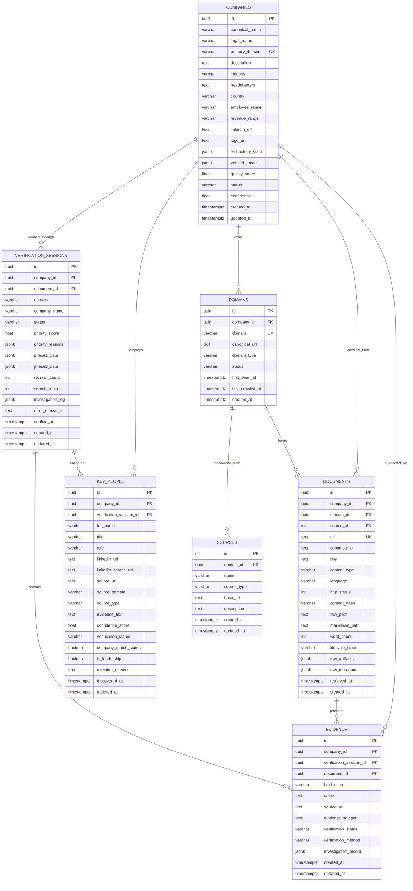

# OpenDB Production Schema Architecture Report

## 1. Executive Summary

This architecture document defines the canonical PostgreSQL schema for OpenDB, replacing the historical accumulation of 35 evolutionary tables with a normalized, production-grade schema where **every business concept has exactly one authoritative owner**.

Operational and telemetry concerns (crawl event streams, search audits, outbox queues) are strictly isolated from core relational entities (`companies`, `domains`, `documents`, `key_people`, `evidence`, `verification_sessions`).

All existing production data—including **2,316 crawled documents**, **231 evidence records**, **25 key people**, **22 verification sessions**, **82,386 activity log entries**, and **5,977 discovery sources**—is preserved with zero data loss.

---

## 2. Live Database Baseline Inventory

* **Audited Instance**: PostgreSQL 15 + pgvector on Docker container `opendb_postgres` (`57.128.27.215:5433/opendb`)
* **Pre-Migration Backup**: `/home/ubuntu/OpenDb/backup_pre_schema_consolidation_20260917.sql.gz` (5.1 MB compressed `pg_dump`)
* **Total Existing Tables**: 35

### Full 35-Table Audit Inventory

| Table Name | Classification | Rows | Disk Size | FKs In/Out | Code Consumers | Purpose & Canonical Assessment | Decision |
| :--- | :--- | :---: | :---: | :---: | :---: | :--- | :--- |
| **`documents`** | CORE BUSINESS | 2,316 | 2.9 MB | 8 / 2 | 17 files | Authoritative crawled web pages, markdown paths, MinIO artifact pointers, and content hashes. | **KEEP & EVOLVE** |
| **`sources`** | DISCOVERY PROVENANCE | 5,977 | 1.2 MB | 1 / 0 | 12 files | Discovered search engine results and crawling seed URLs. | **KEEP & EVOLVE** |
| **`crawl_activity_log`** | OPERATIONAL TELEMETRY | 82,386 | 28 MB | 0 / 0 | 5 files | Live streaming execution log of all crawl attempts. High-throughput event log. | **KEEP** |
| **`batch_results`** | OPERATIONAL TELEMETRY | 23,906 | 3.5 MB | 0 / 0 | 3 files | Batch telemetry for discovery runs and search iteration metrics. | **KEEP** |
| **`search_history`** | OPERATIONAL AUDIT | 2,873 | 728 kB | 0 / 0 | 4 files | Audit log of executed SERP search queries and yield. | **KEEP** |
| **`agent2_evidence`** | CORE BUSINESS | 231 | 392 kB | 0 / 1 | 4 files | Fine-grained proven facts with snippet text and investigation records. | **MIGRATE $\rightarrow$ `evidence`** |
| **`key_person_candidates`** | CORE BUSINESS | 25 | 440 kB | 0 / 0 | 3 files | Executive candidates discovered by Agent 1 search discovery. | **MIGRATE $\rightarrow$ `key_people`** |
| **`agent2_person_candidates`** | CORE BUSINESS | 22 | 80 kB | 0 / 1 | 4 files | LinkedIn candidate profiles evaluated by Agent 2. | **MIGRATE $\rightarrow$ `key_people`** |
| **`agent2_verification_sessions`**| CORE BUSINESS | 22 | 256 kB | 2 / 0 | 6 files | Agent 2 investigation workflow and verification contract lifecycle. | **MIGRATE $\rightarrow$ `verification_sessions`** |
| **`metadata`** | TAXONOMY / LEGACY | 4 | 112 kB | 0 / 0 | 16 files | Stores 4 industry categories ("Technology", "Healthcare", etc.). | **MIGRATE $\rightarrow$ `industry_taxonomies`** |
| **`domains`** | CORE BUSINESS | 4 | 48 kB | 4 / 0 | 20 files | Currently stores 4 taxonomy strings. Evolve into true internet domain table. | **EVOLVE** |
| **`global_leads`** | LEGACY BUSINESS | 3 | 48 kB | 2 / 0 | 10 files | Gen 2 SQLite vault table representing companies. 3 live rows. | **MIGRATE $\rightarrow$ `companies`** |
| **`postgres_sync_outbox`** | LEGACY INFRASTRUCTURE | 3 | 64 kB | 0 / 0 | 4 files | Legacy outbox for SQLite $\rightarrow$ Postgres sync. Obsolete under fail-closed rule. | **MIGRATE & RETIRE** |
| **`agent_state`** | DURABLE INFRASTRUCTURE | 1 | 32 kB | 0 / 0 | 4 files | Singleton autonomous engine coordinator (PAUSED, RUNNING, pacing). | **KEEP** |
| **`artifact_outbox`** | DURABLE INFRASTRUCTURE | 0 | 40 kB | 0 / 0 | 5 files | Durable outbox ensuring raw HTML/markdown uploads to MinIO survive outages. | **KEEP** |
| **`blocked_domains`** | SAFETY / MODERATION | 0 | 16 kB | 0 / 0 | 3 files | Safety blocklist preventing crawling of WAF/malware/excluded domains. | **KEEP** |
| **`manual_review_queue`** | SAFETY / MODERATION | 0 | 16 kB | 0 / 0 | 3 files | Human moderation review queue for ambiguous content. | **KEEP** |
| **`quarantined_content`** | SAFETY / MODERATION | 0 | 16 kB | 0 / 0 | 2 files | Safety quarantine table for flagged/toxic content. | **KEEP** |
| **`keyword_performance`** | OPERATIONAL FEEDBACK | 0 | 16 kB | 0 / 0 | 2 files | Keyword feedback tracking for autonomous discovery loop. | **KEEP** |
| **`crawl_errors`** | OPERATIONAL AUDIT | 0 | 16 kB | 0 / 2 | 3 files | Structured crawl error logging with stack traces. | **KEEP** |
| **`universal_records`** | LEGACY REDUNDANT | 0 | 984 kB | 3 / 3 | 11 files | Gen 1 generic entity table. Superseded by canonical `companies`. | **RETIRE** |
| **`domain_records`** | LEGACY REDUNDANT | 0 | 16 kB | 0 / 2 | 5 files | Gen 1 domain metadata child. 0 rows. | **RETIRE** |
| **`extracted_facts`** | LEGACY REDUNDANT | 0 | 16 kB | 1 / 2 | 6 files | Gen 1 fact table. 0 rows. Superseded by `evidence`. | **RETIRE** |
| **`evidence` (Gen 1)** | LEGACY REDUNDANT | 0 | 16 kB | 0 / 2 | 20 files | Gen 1 empty table. Replaced by consolidated canonical `evidence`. | **REUSE & EVOLVE** |
| **`global_lead_people`** | LEGACY REDUNDANT | 0 | 24 kB | 0 / 1 | 5 files | Gen 2 people table. 0 rows. Superseded by `key_people`. | **RETIRE** |
| **`global_lead_subpages`** | LEGACY REDUNDANT | 0 | 24 kB | 0 / 1 | 4 files | Gen 2 subpages table. 0 rows. Subpages are naturally in `documents`. | **RETIRE** |
| **`open_lake_records`** | LEGACY REDUNDANT | 0 | 16 kB | 0 / 0 | 2 files | Gen 2 candidate dispatch table. 0 rows. Superseded by `sources` + Redis. | **RETIRE** |
| **`crawl_jobs`** | LEGACY REDUNDANT | 0 | 16 kB | 3 / 0 | 3 files | Gen 1 monolithic crawl jobs. 0 rows. OpenDB uses Celery tasks. | **RETIRE** |
| **`document_versions`** | LEGACY REDUNDANT | 0 | 16 kB | 0 / 1 | 2 files | Gen 1 document versions. 0 rows. Versioning is in MinIO + content hashes. | **RETIRE** |
| **`extraction_runs`** | LEGACY REDUNDANT | 0 | 8 kB | 0 / 3 | 2 files | Gen 1 run telemetry. 0 rows. Telemetry logged in `crawl_activity_log`. | **RETIRE** |
| **`resources`** | LEGACY REDUNDANT | 0 | 16 kB | 1 / 1 | 14 files | Gen 1 asset discovery. 0 rows. Assets are in `documents.raw_artifacts`. | **RETIRE** |
| **`resource_links`** | LEGACY REDUNDANT | 0 | 16 kB | 0 / 2 | 2 files | Gen 1 link table. 0 rows. | **RETIRE** |
| **`subdomains`** | LEGACY REDUNDANT | 0 | 16 kB | 1 / 1 | 5 files | Gen 1 subdomain table. 0 rows. Subdomains belong directly in `domains`. | **RETIRE** |
| **`verification_records`**| LEGACY REDUNDANT | 0 | 16 kB | 0 / 1 | 3 files | Gen 1 verification table. 0 rows. Replaced by `verification_sessions`. | **RETIRE** |
| **`schema_definitions`** | LEGACY REDUNDANT | 0 | 24 kB | 0 / 0 | 2 files | Gen 1 schema definitions. 0 rows. Schemas live on disk in `/schemas`. | **RETIRE** |

---

## 3. Canonical Architecture & ER Diagram

---

## 4. Retained Table Rationale & Responsibilities

### Core Business Entities (7 Tables)
1. **`companies`**: The single authoritative source of truth for evaluated business organizations. Eliminates the split authority between `documents`, `global_leads`, and `universal_records`.
2. **`domains`**: Canonical domain registry tracking normalized internet domains (`linear.app`) and company associations.
3. **`sources`**: Discovered search results and seed URLs that feed the crawl pipeline.
4. **`documents`**: Scraped web pages, markdown references, HTTP status, and content hashes. Points to raw HTML and markdown objects in MinIO.
5. **`key_people`**: Unified executive and leadership registry, consolidating Agent 1 discovery candidates and Agent 2 LinkedIn profiles into one table with a clean lifecycle status.
6. **`verification_sessions`**: Authoritative lifecycle tracker for Agent 2 deep investigation sessions.
7. **`evidence`**: Field-level provenance and verification audit facts documenting *why* a company attribute is verified.

### Operational, Safety & Infrastructure Tables (11 Tables)
8. **`crawl_activity_log`**: Append-only operational telemetry stream (82k+ events).
9. **`batch_results`**: Autonomous batch search metrics (23k+ events).
10. **`search_history`**: Audit log of executed SERP search queries (2.8k events).
11. **`agent_state`**: Singleton coordinator tracking engine run status.
12. **`artifact_outbox`**: Transactional outbox ensuring MinIO uploads survive transient storage outages.
13. **`crawl_errors`**: Structured crawl error logging.
14. **`blocked_domains`**: Production security blocklist (WAF/malware exclusions).
15. **`manual_review_queue`**: Safety review queue for ambiguous content.
16. **`quarantined_content`**: Content moderation quarantine.
17. **`keyword_performance`**: Autonomous keyword yield feedback loop.
18. **`industry_taxonomies`**: Clean table preserving the 4 taxonomy category records migrated from legacy `domains`.

---

## 5. Migration Execution & Zero-Data-Loss Proof

### Migration Staging Order
1. **CREATE TABLE IF NOT EXISTS** canonical tables (`companies`, `key_people`, `verification_sessions`, `evidence`, `industry_taxonomies`).
2. **Backfill `companies`**:
   * Migrate 3 records from `global_leads`.
   * Initialize companies for verified domains from `agent2_verification_sessions` (22 domains).
3. **Backfill `key_people`**:
   * Migrate 25 records from `key_person_candidates`.
   * Migrate 22 records from `agent2_person_candidates`.
4. **Backfill `verification_sessions`**:
   * Migrate 22 records from `agent2_verification_sessions` with FK linkage to `companies`.
5. **Backfill `evidence`**:
   * Migrate 231 records from `agent2_evidence` with FK linkage to `verification_sessions` and `companies`.
6. **Backfill `industry_taxonomies`**:
   * Migrate 4 taxonomy rows from legacy `domains`.
7. **Link `documents` and `sources`** to canonical `companies` and `domains`.
8. **Integrity Validation**: Verify row counts match exactly with 0 orphaned FKs.
9. **Update Application Code**: Update SQLAlchemy models, API endpoints, and agents.
10. **Controlled Legacy Retirement**: Drop verified legacy tables after full application validation.
