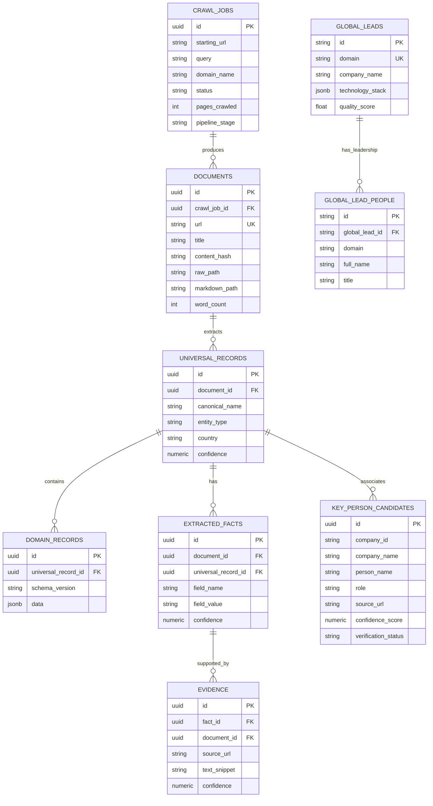

# Database Schema & Data Models Documentation

OpenDB uses a dual relational database architecture: **PostgreSQL 15 + pgvector** for universal metadata, domain payloads, atomized facts, and vector search; and an **SQLite WAL Master Vault** (`global_leads.db`) for high-speed local lead querying.

---

## 1. Entity Relationship (ER) Diagram

---

## 2. Core Relational Tables (PostgreSQL)

Defined in [`backend/app/persistence/models.py`](file:///e:/crawl/backend/app/persistence/models.py) and [`init.sql`](file:///e:/crawl/init.sql):

### 1. `crawl_jobs`
Tracks asynchronous crawl job execution, pipeline stage, and page counts.
- `id` (UUID, Primary Key)
- `starting_url` (Text, Not Null)
- `query` (Text, Nullable)
- `domain_name` (VARCHAR(100), Nullable)
- `status` (VARCHAR(50), default 'pending')
- `pipeline_stage` (VARCHAR(100), default 'INITIALIZED')
- `pipeline_details` (JSONB)

### 2. `documents`
Tracks crawled web pages, HTTP status, word counts, content hashes, and file storage paths.
- `id` (UUID, Primary Key)
- `crawl_job_id` (UUID, Foreign Key → `crawl_jobs.id`)
- `url` (Text, Unique, Not Null)
- `canonical_url` (Text, Nullable)
- `title` (Text, Nullable)
- `content_hash` (VARCHAR(64), Not Null)
- `markdown_path` (Text, Nullable) — MinIO path (`data/processed/markdown/{hash}.md`)
- `content_embedding` (Vector(384)) — pgvector 384-dimensional embedding

### 3. `universal_records`
Core domain-agnostic metadata representing an entity.
- `id` (UUID, Primary Key)
- `document_id` (UUID, Foreign Key → `documents.id`)
- `entity_type` (VARCHAR(100))
- `canonical_name` (Text)
- `title` (Text)
- `description` (Text)
- `url` (Text)
- `country` (VARCHAR(100))
- `confidence` (Numeric(5,4))

### 4. `domain_records`
Dynamic domain payload stored in JSONB for schema flexibility.
- `id` (UUID, Primary Key)
- `universal_record_id` (UUID, Foreign Key → `universal_records.id`)
- `schema_version` (VARCHAR(50))
- `data` (JSONB, Not Null) — Dynamic firmographic fields (tech stack, headcount, revenue, etc.)

### 5. `extracted_facts` & `evidence`
Field-level facts with exact text snippets and URL provenance.
- `extracted_facts`: `field_name`, `field_value`, `value_type`, `confidence`, `extractor`.
- `evidence`: `fact_id`, `source_url`, `text_snippet`, `selector`, `confidence`.

### 6. `key_person_candidates`
Key decision makers and leadership candidates discovered by the parallel pipeline.
- `id` (UUID, Primary Key)
- `company_id` (VARCHAR(255), Foreign Key)
- `company_name` (VARCHAR(255), Not Null)
- `person_name` (VARCHAR(255), Not Null)
- `role` (VARCHAR(255), Nullable)
- `source_url` (Text, Nullable)
- `source_domain` (VARCHAR(255), Nullable)
- `source_type` (VARCHAR(50)) — `OFFICIAL_WEBSITE`, `PUBLIC_REFERENCE`, `LINKEDIN`
- `discovery_query` (Text)
- `evidence_text` (Text)
- `confidence_score` (Numeric(5,4))
- `verification_status` (VARCHAR(50)) — `VERIFIED`, `HIGH_CONFIDENCE`, `PENDING_VERIFICATION`, `REJECTED`

---

## 3. Master Lead Vault Tables (SQLite WAL)

### 1. `global_leads`
- `id` (VARCHAR(36), PK — MD5 hash of domain)
- `domain` (VARCHAR(255), Unique, Index)
- `company_name` (VARCHAR(255), Not Null)
- `technology_stack` (JSONB)
- `quality_score` (Float)
- `headquarters` (Text)
- `summary` (Text)

### 2. `global_lead_people`
- `id` (VARCHAR(36), PK — MD5 hash of domain + full_name)
- `global_lead_id` (Foreign Key → `global_leads.id`)
- `domain` (VARCHAR(255))
- `full_name` (VARCHAR(255))
- `title` (VARCHAR(255))
