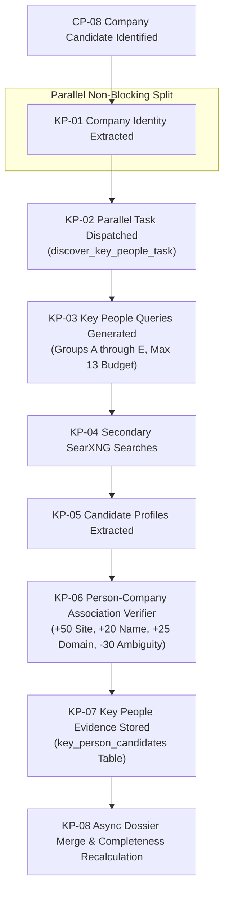

# Key People Pipeline — KP-01 through KP-08 Technical Breakdown

This document provides a technical breakdown of the **Parallel Key People Discovery Pipeline (`KP-01` through `KP-08`)** in OpenDB. This pipeline executes as an asynchronous, non-blocking branch immediately following company candidate identification (`CP-08`).

---

## 1. High-Level Flow Diagram




---

## 2. Checkpoint Details (KP-01 through KP-08)

### KP-01 — Company Identity Extracted
- **Trigger**: Called immediately when `CP-08` produces a valid company candidate.
- **Context Object**: `CompanyDiscoveryContext` containing `company_name`, `official_domain`, `candidate_id`, `run_id`.
- **Implementation**: [`backend/app/agent/key_people_discovery_agent.py`](file:///e:/crawl/backend/app/agent/key_people_discovery_agent.py#L30-L70).

### KP-02 — Key People Search Triggered
- **Worker Task**: `discover_key_people_task` in [`backend/app/worker/tasks.py`](file:///e:/crawl/backend/app/worker/tasks.py).
- **Execution Model**: Dispatched via `_safe_dispatch` to Redis Celery queue or background daemon thread.
- **Non-Blocking Guarantee**: The main company crawling pipeline (`CP-09` through `CP-13`) continues without waiting for `KP-02` completion.

### KP-03 — Key People Queries Generated
- **File**: [`backend/app/agent/key_people_discovery_agent.py`](file:///e:/crawl/backend/app/agent/key_people_discovery_agent.py#L80-L150)
- **Class**: `KeyPeopleDiscoveryAgent`
- **Output**: Array of safe search query strings categorized across 5 strategy groups.

### KP-04 — Secondary SearXNG Search
- **File**: [`backend/app/crawler/searxng_service.py`](file:///e:/crawl/backend/app/crawler/searxng_service.py)
- **Processing**: Executes secondary searches against SearXNG.
- **Query Budget**: Max 13 queries per company candidate. Adaptive stopping halts remaining queries if $\ge 3$ verified leaders are discovered.

### KP-05 — Candidate Profile Extraction
- **Processing**: Parses search snippets, page titles, and meta descriptions to extract person names, titles, and profile source URLs.

### KP-06 — Person-Company Association Verification
- **File**: [`backend/app/extraction/person_verifier.py`](file:///e:/crawl/backend/app/extraction/person_verifier.py#L40-L120)
- **Class**: `PersonCompanyVerifier`
- **Processing**: Evaluates multi-signal association confidence score.

### KP-07 — Evidence Storage
- **File**: [`backend/app/persistence/repositories.py`](file:///e:/crawl/backend/app/persistence/repositories.py)
- **Table**: `key_person_candidates` in PostgreSQL and `global_lead_people` in SQLite Master Vault.

### KP-08 — Asynchronous Dossier Merge & Rescore
- **Processing**: Merges key person evidence into the unified company dossier and updates the company completeness score (+10 for 1 leader, +20 for 2, +25 for Founder + leadership team).

---

## 3. Query Strategy Groups A–E

| Group | Strategy Name | Query Format Examples | Priority / Source Weight |
| :--- | :--- | :--- | :--- |
| **Group A** | Founder Discovery | `"{company}" founder`<br>`"{company}" co-founder` | High (0.9) |
| **Group B** | Executive Discovery | `"{company}" CEO`<br>`"{company}" CTO`<br>`"{company}" leadership` | High (0.9) |
| **Group C** | LinkedIn Reference | `"{company}" CEO site:linkedin.com/in`<br>`"{company}" founder site:linkedin.com/in` | Medium (0.7) |
| **Group D** | Official Website | `site:{domain} founder`<br>`site:{domain} leadership`<br>`site:{domain} team` | Highest (1.0) |
| **Group E** | External Evidence | `"{company}" executive director`<br>`"{company}" CEO company` | Medium-Low (0.6) |

---

## 4. Person-Company Verification Engine & Scoring Model

The `PersonCompanyVerifier` evaluates signals to calculate a confidence score between 0 and 100:

```python
# Signal weights inside backend/app/extraction/person_verifier.py
SCORE_WEIGHTS = {
    "official_website_listing": +50,  # Person listed on site:{official_domain}
    "official_domain_evidence":  +25,  # Evidence URL matches company domain
    "exact_company_name_match":  +20,  # Exact company name in snippet
    "exact_executive_role_match": +15, # CEO, Founder, CTO title matched
    "secondary_source_confirm":  +15,  # Confirmed across multiple queries
    "search_snippet_only":       +5,   # Unverified search snippet only
    "ambiguous_company_match":   -30   # Conflicting or ambiguous company reference
}
```

### Categorization Thresholds

| Confidence Score Range | Classification Status | UI Display Badge | Completeness Weight |
| :--- | :--- | :--- | :--- |
| **$90 - 100$** | `VERIFIED` | Green Verified Badge (`✓ Verified`) | Full points awarded |
| **$70 - 89$** | `HIGH_CONFIDENCE` | Blue High Confidence Badge (`✓ High Confidence`) | Partial points awarded |
| **$50 - 69$** | `PENDING_VERIFICATION` | Yellow Pending Badge (`⏳ Pending Verification`) | 0 points awarded |
| **$< 50$** | `REJECTED` | Hidden / Rejected | 0 points awarded |

---

## 5. Non-Blocking Parallel Execution Model

```text
USER CLICK / AGENT LOOP
          │
          ▼
   Company Discovered (CP-08)
          │
    ┌─────┴───────────────────────────┐
    │                                 │
    ▼                                 ▼
COMPANY PIPELINE             KEY PEOPLE PIPELINE
(CP-09..CP-13 Domain Res)    (KP-01..KP-07 Async Task)
    │                                 │
    ▼                                 ▼
Crawl4AI Page Crawling        SearXNG Secondary Searches
    │                                 │
    ▼                                 ▼
MinIO & Postgres Save         Association Verification
    │                                 │
    └────────────────┬────────────────┘
                     ▼
             ASYNCHRONOUS MERGE
              (KP-08 Rescore)
```

1. **No Pipeline Stalling**: Company crawling finishes independently of search engine speed for secondary queries.
2. **Dynamic UI Enrichment**: The dashboard displays the company record immediately upon crawl completion and dynamically updates the **KEY PEOPLE DISCOVERED** section as background key people tasks finish.
