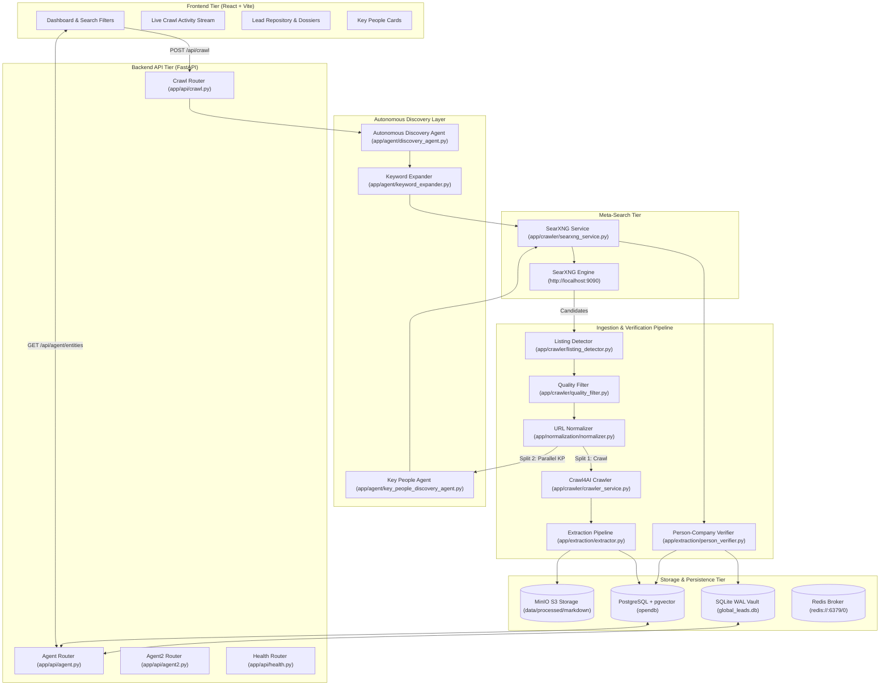
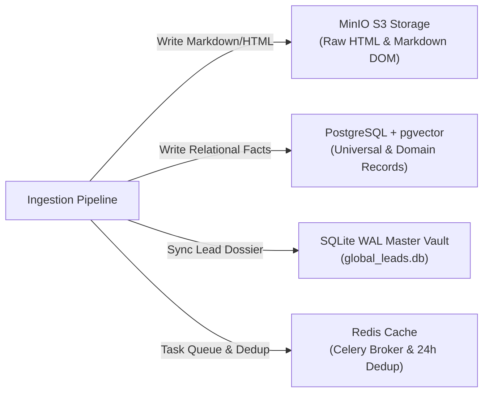

# OpenDB Technical System Architecture — Master Technical Blueprint

## 1. Executive Summary
OpenDB is an enterprise-grade autonomous web crawling, entity discovery, and domain-aware ingestion engine. It transforms raw, unstructured web content into structured relational dossiers, firmographics, and verified key leadership decision-makers in PostgreSQL and SQLite WAL Master Vault.

## 2. System Overview
OpenDB isolates web crawling (executed asynchronously via Crawl4AI / Playwright) from content extraction, normalization, verification, and persistence. The system operates in two execution modes:
- **Interactive Mode**: User-triggered crawls via FastAPI endpoints (`/api/crawl`).
- **Autonomous Mode**: 24/7 continuous discovery agent (`AutonomousDiscoveryAgent`) generating taxonomical search strategies.

## 3. High-Level Architecture Diagram


### Terminal Monospace Layered Architecture Diagram

```text
┌─────────────────────────────────────────────────────────────────────────────────────────┐
│                        LAYER 1: INGESTION & INPUT TIER                                  │
├─────────────────────────────────────────────────────────────────────────────────────────┤
│                                                                                         │
│  ┌──────────────────────────────┐        ┌───────────────────────────────────────────┐  │
│  │  REACT FRONTEND DASHBOARD    │        │  AUTONOMOUS 24/7 DISCOVERY AGENT         │  │
│  │  • Interactive Crawl Submit  │        │  • Continuous Taxonomical Query Loop      │  │
│  │  • Real-Time Stream Poller   │        │  • Keyword Expander & Strategy Engine     │  │
│  └──────────────┬───────────────┘        └─────────────────────┬─────────────────────┘  │
│                 │                                              │                        │
│                 └───────────────────────┬──────────────────────┘                        │
│                                         ▼                                               │
│                         ┌───────────────────────────────┐                               │
│                         │ SEARXNG META-SEARCH ENGINE    │                               │
│                         │ • Multi-Source Result Agg     │                               │
│                         │ • Domain Safety Filter Check  │                               │
│                         └───────────────┬───────────────┘                               │
└─────────────────────────────────────────┼───────────────────────────────────────────────┘
                                          │
                                          ▼
┌─────────────────────────────────────────────────────────────────────────────────────────┐
│                 LAYER 2: PROCESSING, QUEUE & CORE LOGIC TIER                            │
├─────────────────────────────────────────────────────────────────────────────────────────┤
│                                                                                         │
│                         ┌───────────────────────────────┐                               │
│                         │ FASTAPI BACKEND & DISPATCHER  │                               │
│                         │ • Endpoint Routers & State    │                               │
│                         │ • Candidate Context (CP-08)   │                               │
│                         └───────────────┬───────────────┘                               │
│                                         │                                               │
│                 ┌───────────────────────┴───────────────────────┐                        │
│                 ▼                                               ▼                       │
│  ┌──────────────────────────────┐                ┌───────────────────────────────────┐  │
│  │ COMPANY CRAWLING PIPELINE    │                │ PARALLEL KEY PEOPLE PIPELINE      │  │
│  │ (CP-09 to CP-30)             │                │ (KP-01 to KP-08)                  │  │
│  ├──────────────────────────────┤                ├───────────────────────────────────┤  │
│  │ • CP-11 Canonical Domain Res │                │ • KP-03 Query Generator (A to E)  │  │
│  │ • Crawl4AI Playwright BFS    │                │ • Secondary SearXNG Search Worker │  │
│  │ • Dual Extractor (CSS + LLM) │                │ • Person-Company Verifier         │  │
│  │ • MinIO DOM & Fact Generator │                │ • Confidence Scoring (+50/-30)    │  │
│  └──────────────┬───────────────┘                └─────────────────┬─────────────────┘  │
│                 │                                                  │                    │
│                 └───────────────────────┬──────────────────────────┘                    │
│                                         │                                               │
│                                         ▼                                               │
│                         ┌───────────────────────────────┐                               │
│                         │ SAFE DISPATCH & WORKER ENGINE │                               │
│                         │ • Redis Celery Queue Task     │                               │
│                         │ • Daemon Thread Fallback      │                               │
│                         └───────────────┬───────────────┘                               │
└─────────────────────────────────────────┼───────────────────────────────────────────────┘
                                          │
                                          ▼
┌─────────────────────────────────────────────────────────────────────────────────────────┐
│                     LAYER 3: STORAGE & PERSISTENCE TIER                                 │
├─────────────────────────────────────────────────────────────────────────────────────────┤
│                                                                                         │
│  ┌───────────────────────┐   ┌───────────────────────────┐   ┌─────────────────────────┐  │
│  │ REDIS TASK BROKER     │   │ POSTGRESQL + PGVECTOR     │   │ SQLITE WAL MASTER VAULT │  │
│  │ & DEDUP CACHE         │   │                           │   │                         │  │
│  ├───────────────────────┤   ├───────────────────────────┤   ├─────────────────────────┤  │
│  │ • Celery Queue        │   │ • Universal Records       │   │ • global_leads Table    │  │
│  │ • 24h Key-People      │   │ • Dynamic JSONB Payloads  │   │ • global_lead_people    │  │
│  │   Dedup Cache         │   │ • Key Person Candidates   │   │ • Ultra-Fast Lead Vault │  │
│  └───────────────────────┘   └───────────────────────────┘   └─────────────────────────┘  │
│                                                                                         │
│                           ┌───────────────────────────────┐                             │
│                           │ MINIO S3 OBJECT STORAGE       │                             │
│                           ├───────────────────────────────┤                             │
│                           │ • Cleaned Markdown DOMs       │                             │
│                           │ • Raw Page HTML & Assets      │                             │
│                           └───────────────────────────────┘                             │
└─────────────────────────────────────────────────────────────────────────────────────────┘
```




---

## 4. Runtime Architecture Inventory

| Component | File / Module Path | Responsibility | Inputs | Outputs | Dependencies |
| :--- | :--- | :--- | :--- | :--- | :--- |
| **FastAPI Core** | [`backend/app/main.py`](file:///e:/crawl/backend/app/main.py) | Application entrypoint & CORS | HTTP requests | JSON API | Uvicorn, FastAPI |
| **Discovery Agent** | [`backend/app/agent/discovery_agent.py`](file:///e:/crawl/backend/app/agent/discovery_agent.py) | 24/7 continuous discovery loop | Taxonomical seeds | SearXNG searches | LiteLLM, SessionLocal |
| **Key People Agent**| [`backend/app/agent/key_people_discovery_agent.py`](file:///e:/crawl/backend/app/agent/key_people_discovery_agent.py) | Generates Groups A-E query strategies | Company name, domain | Search queries | SearchQueryGuard |
| **SearXNG Client** | [`backend/app/crawler/searxng_service.py`](file:///e:/crawl/backend/app/crawler/searxng_service.py) | Executes HTTP queries against SearXNG | Query string | Search result items | HTTPX / Requests |
| **Crawl4AI Service**| [`backend/app/crawler/crawler_service.py`](file:///e:/crawl/backend/app/crawler/crawler_service.py) | Async Playwright BFS crawling | Target URL | Markdown DOM & raw HTML | Playwright, Crawl4AI |
| **Normalizer** | [`backend/app/normalization/normalizer.py`](file:///e:/crawl/backend/app/normalization/normalizer.py) | Tracking param & fragment removal | Raw URL | Canonical domain URL | `urllib.parse`, `tldextract` |
| **CSS Extractor** | [`backend/app/extraction/css_extractor.py`](file:///e:/crawl/backend/app/extraction/css_extractor.py) | Mode 1 deterministic HTML extraction | HTML DOM | OpenGraph, JSON-LD, H1 | BeautifulSoup4 |
| **LLM Extractor** | [`backend/app/extraction/llm_extractor.py`](file:///e:/crawl/backend/app/extraction/llm_extractor.py) | Mode 2 domain semantic extraction | Text / Markdown | Domain payload JSON | LiteLLM / OpenAI API |
| **Person Verifier** | [`backend/app/extraction/person_verifier.py`](file:///e:/crawl/backend/app/extraction/person_verifier.py) | Multi-signal confidence calculation | Person candidate | Status & confidence | Re / Regex rules |
| **Celery Workers** | [`backend/app/worker/tasks.py`](file:///e:/crawl/backend/app/worker/tasks.py) | Async queue task execution | Celery messages | Storage DB updates | Redis, Celery |
| **Vault Service** | [`backend/app/persistence/vault_service.py`](file:///e:/crawl/backend/app/persistence/vault_service.py) | SQLite WAL & MinIO synchronization | UniversalRecord | GlobalLead row | SQLite3, MinIO Client |

---

## 5. Company Discovery Pipeline (CP-01 to CP-30)

The company ingestion workflow progresses through 30 structured checkpoints:
- **CP-01 (Agent Startup)**: Loads state from `agent_state` table.
- **CP-02 (Discovery Strategy)**: Selects active domain (Technology, Healthcare, Education, Business).
- **CP-03 (Keyword Generation)**: `KeywordExpander` generates taxonomical search terms.
- **CP-04 (Keyword Rotation)**: Checks usage limits in `keyword_performance`.
- **CP-05 (Query Safety Guard)**: Validates queries via `guardrails.py`.
- **CP-06 (Primary SearXNG Search)**: Dispatches search request to SearXNG.
- **CP-07 (Candidate Validation)**: Filters results using `quality_filter.py`.
- **CP-08 (Candidate Creation)**: Instantiates `CompanyDiscoveryContext`.
- **CP-09 (Domain Safety Filter)**: Validates domain against `blocked_domains`.
- **CP-10 (Domain Classification)**: Classifies company category using `domain_classifier.py`.
- **CP-11 (Official Domain Resolution)**: Resolves canonical homepage domain (detailed in Section 6).
- **CP-12 (Deduplication)**: Verifies canonical domain does not exist in `documents` or `universal_records`.
- **CP-13 (Crawl Queue Enqueue)**: Dispatches task via `_safe_dispatch(crawl_entity_task)`.
- **CP-14 to CP-29 (Deep Crawl & Extraction)**:
  - Crawls subpages (`/about`, `/team`, `/contact`).
  - Saves raw HTML & markdown DOM to MinIO (`data/processed/markdown/{hash}.md`).
  - Extracts CSS metadata, OpenGraph, JSON-LD, and LLM firmographics.
  - Generates universal record, domain payload, and atomized facts.
- **CP-30 (Dashboard & Completeness)**: Calculates completeness score and updates dashboard.

---

## 6. CP-11 — Official Domain Resolution Engine

`CP-11` converts raw search result URLs into canonical company domains:

```text
Raw Search URL: "https://www.linkedin.com/company/datai2i?utm_source=searxng#about"
        ↓
1. Redirect Resolution (httpx follow redirects)
        ↓
2. Tracking Parameter Stripping (removes utm_*, gclid, fbclid)
        ↓
3. Fragment Removal (removes #about)
        ↓
4. TLD Extraction (tldextract.extract -> domain="datai2i", suffix="com")
        ↓
5. Canonical Homepage Construction ("https://datai2i.com")
```

Implementation location: [`backend/app/normalization/normalizer.py:normalize_url()`](file:///e:/crawl/backend/app/normalization/normalizer.py#L18-L45).

---

## 7. Key People Pipeline (KP-01 to KP-08)

Runs as an asynchronous, non-blocking parallel branch immediately after `CP-08`:
- **KP-01 (Identity Extracted)**: Extracts `company_name` and `official_domain`.
- **KP-02 (Parallel Worker Triggered)**: Dispatches `discover_key_people_task`.
- **KP-03 (Queries Generated)**: Generates 5 targeted query groups (Groups A-E).
- **KP-04 (Secondary SearXNG Search)**: Executes queries against SearXNG (max budget 13).
- **KP-05 (Candidate Extraction)**: Extracts names, roles, source URLs, and text snippets.
- **KP-06 (Association Verification)**: Evaluates confidence via `PersonCompanyVerifier`.
- **KP-07 (Evidence Storage)**: Stores records in `key_person_candidates`.
- **KP-08 (Async Dossier Merge)**: Merges decision makers into company dossier and recalculates completeness score.

---

## 8. Query Strategy Groups A–E

Implemented in [`backend/app/agent/key_people_discovery_agent.py`](file:///e:/crawl/backend/app/agent/key_people_discovery_agent.py):

| Group | Name | Query Templates | Priority / Trust |
| :--- | :--- | :--- | :--- |
| **Group A** | Founder Discovery | `"{company}" founder`, `"{company}" co-founder` | High |
| **Group B** | Executive Discovery | `"{company}" CEO`, `"{company}" CTO`, `"{company}" leadership` | High |
| **Group C** | LinkedIn Reference | `"{company}" CEO site:linkedin.com/in` | Medium |
| **Group D** | Official Website | `site:{domain} founder`, `site:{domain} leadership` | Highest (1.0) |
| **Group E** | External Evidence | `"{company}" executive director` | Medium-Low |

---

## 9. Person-Company Association Verification Scoring

Implemented in [`backend/app/extraction/person_verifier.py`](file:///e:/crawl/backend/app/extraction/person_verifier.py):

| Verification Signal | Score Delta |
| :--- | :--- |
| Official website source listing (`site:{domain}`) | $+50$ |
| Exact company name match in snippet | $+20$ |
| Exact executive role match (CEO, Founder, CTO) | $+15$ |
| Official domain evidence link | $+25$ |
| Consistent secondary source confirmation | $+15$ |
| Search snippet only reference | $+5$ |
| Ambiguous / conflicting company association | $-30$ |

### Classification Thresholds:
- **$\ge 90$**: `VERIFIED`
- **$70 - 89$**: `HIGH_CONFIDENCE`
- **$50 - 69$**: `PENDING_VERIFICATION`
- **$< 50$**: `REJECTED`

---

## 10. Data Storage Architecture



- **PostgreSQL**: Stores relational tables (`universal_records`, `domain_records`, `extracted_facts`, `evidence`, `key_person_candidates`, `documents`, `crawl_jobs`).
- **SQLite Master Vault**: Local WAL database (`global_leads`, `global_lead_people`, `global_lead_subpages`) optimized for fast lead queries.
- **MinIO Object Storage**: Stores markdown DOM files at `data/processed/markdown/{hash}.md` and raw HTML.
- **Redis Cache**: Queue broker (`celery`) and 24-hour deduplication cache (`key_people_discovery:{domain}`).

---

## 11. Current vs Legacy Code Component Classification


### Agent 1 vs Agent 2 Terminal Monospace Diagram

```text
┌─────────────────────────────────────────────────────────────────────────────────────────┐
│              AGENT 1 — CONTINUOUS DISCOVERY & INGESTION TIER (24/7 AUTOMATED)           │
├─────────────────────────────────────────────────────────────────────────────────────────┤
│                                                                                         │
│  ┌──────────────────────────┐     ┌──────────────────────────┐     ┌─────────────────┐  │
│  │ 24/7 TAXONOMICAL SEEDS   │ ──► │ SEARXNG META-SEARCH      │ ──► │ DOMAIN SAFETY & │  │
│  │ Keyword Expander Loop    │     │ Candidate Discovery      │     │ CP-11 RESOLUTION│  │
│  └──────────────────────────┘     └──────────────────────────┘     └────────┬────────┘  │
│                                                                             │           │
│                                           ┌─────────────────────────────────┘           │
│                                           ▼                                             │
│  ┌──────────────────────────┐     ┌──────────────────────────┐     ┌─────────────────┐  │
│  │ CRAWL4AI BFS CRAWLER     │ ──► │ PARALLEL KEY PEOPLE SPLIT│ ──► │ MINIO DOM SAVE &│  │
│  │ Playwright Subpage Crawl │     │ KP-01 to KP-08 Worker    │     │ POSTGRES INGEST │  │
│  └──────────────────────────┘     └──────────────────────────┘     └────────┬────────┘  │
│                                                                             │           │
│                                           ┌─────────────────────────────────┘           │
│                                           ▼                                             │
│                         STATUS: CRAWLED_PENDING_AGENT_2                                 │
└───────────────────────────────────────────┬─────────────────────────────────────────────┘
                                            │
                                            ▼
┌─────────────────────────────────────────────────────────────────────────────────────────┐
│             AGENT 2 — DEEP INVESTIGATION & VERIFICATION TIER (ON-DEMAND)                │
├─────────────────────────────────────────────────────────────────────────────────────────┤
│                                                                                         │
│  ┌──────────────────────────┐     ┌──────────────────────────┐     ┌─────────────────┐  │
│  │ ON-DEMAND TRIGGER        │ ──► │ HAYSTACK PIPELINES       │ ──► │ MULTI-SIGNAL    │  │
│  │ POST /api/agent2         │     │ Query & Retrieval Nodes  │     │ EVIDENCE AUDIT  │  │
│  └──────────────────────────┘     └──────────────────────────┘     └────────┬────────┘  │
│                                                                             │           │
│                                           ┌─────────────────────────────────┘           │
│                                           ▼                                             │
│  ┌──────────────────────────┐     ┌──────────────────────────┐     ┌─────────────────┐  │
│  │ CROSS-SOURCE VERIFIER    │ ──► │ VECTOR EMBEDDING MATCH   │ ──► │ FINAL DOSSIER   │  │
│  │ PersonCompanyVerifier   │     │ 384-dim pgvector Search  │     │ REScore (0-100) │  │
│  └──────────────────────────┘     └──────────────────────────┘     └────────┬────────┘  │
│                                                                             │           │
│                                           ┌─────────────────────────────────┘           │
│                                           ▼                                             │
│                            STATUS: VERIFIED DOSSIER                                     │
└─────────────────────────────────────────────────────────────────────────────────────────┘
```

| Component | Status | Location | Evidence |
| :--- | :--- | :--- | :--- |
| **FastAPI Backend Core** | **ACTIVE** | `backend/app/main.py`, `app/api/` | Main server runtime |
| **Autonomous Discovery Agent**| **ACTIVE** | `backend/app/agent/discovery_agent.py` | 24/7 background thread |
| **Key People Pipeline** | **ACTIVE** | `backend/app/agent/key_people_discovery_agent.py` | Executed via Celery task |
| **Vault Service (SQLite)** | **ACTIVE** | `backend/app/persistence/vault_service.py` | Synced on lead persistence |
| **Agent 2 Orchestrator** | **PARTIALLY USED / EXPERIMENTAL** | `backend/app/agent/agent2_orchestrator.py` | Triggered via `/api/agent2` |
| **Haystack Pipelines** | **PARTIALLY USED** | `backend/app/haystack/pipelines.py` | Used in vector search endpoints |

---

## 12. Architecture Discrepancies & Code Realities

1. **Celery Worker Fallback**: Standard Celery workers are complemented by a safe-dispatch mechanism (`_safe_dispatch`). If Celery/Redis is unreachable, tasks execute in background daemon threads.
2. **Dual Lead Vault**: OpenDB writes to both PostgreSQL (`universal_records`) and SQLite WAL Vault (`global_leads`) simultaneously via `VaultService`.
3. **Agent 2 Status**: Agent 2 investigation components exist under `app/agent/agent2_*.py` and `/api/agent2`, operating as an optional deep investigation tier on top of Agent 1.
