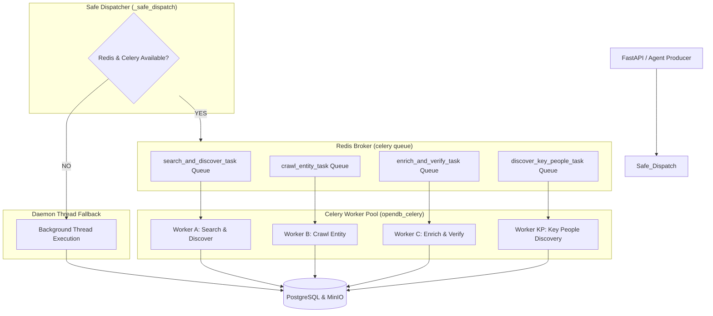

# Queue & Worker Architecture — Task Orchestration System

OpenDB uses a distributed task processing architecture powered by **Celery** and **Redis**, backed by an automatic **Safe Dispatch** fallback engine to guarantee high task availability even when external queues are temporarily unreachable.

---

## 1. Queue Architecture Diagram



---

## 2. Active Celery Worker Tasks

Defined in [`backend/app/worker/tasks.py`](file:///e:/crawl/backend/app/worker/tasks.py):

| Task Name | Task Function | Input Arguments | Functionality | Target Storage |
| :--- | :--- | :--- | :--- | :--- |
| `search_and_discover_task` | `search_and_discover_task()` | `keyword`, `domain`, `subdomain`, `batch_id` | Executes SearXNG search, filters listing URLs, enqueues entity crawl tasks | `search_history`, `crawl_activity_log` |
| `crawl_entity_task` | `crawl_entity_task()` | `url`, `domain`, `subdomain`, `job_id` | Executes Crawl4AI BFS crawl on company website & subpages (`/about`, `/team`), extracts metadata | `documents`, `universal_records`, `MinIO` |
| `enrich_and_verify_task` | `enrich_and_verify_task()` | `universal_record_id` | Performs deduplication, firmographic normalization, and multi-signal confidence verification | `verification_records`, `global_leads` |
| `discover_key_people_task` | `discover_key_people_task()` | `company_id`, `company_name`, `official_domain`, `run_id` | Generates Groups A-E queries, executes secondary SearXNG searches, verifies person-company association | `key_person_candidates`, `global_lead_people` |

---

## 3. Safe Dispatch Mechanism

Implemented in [`backend/app/worker/tasks.py`](file:///e:/crawl/backend/app/worker/tasks.py#L94-L116):

```python
def _safe_dispatch(task_func, **kwargs):
    """
    Safely dispatch task.
    Attempts direct Celery enqueueing to the Redis queue.
    If Redis or Celery enqueueing fails, falls back to a background daemon thread.
    """
    dispatched = False
    try:
        task_func.apply_async(kwargs=kwargs, queue="celery")
        dispatched = True
        logger.info(f"[Safe Dispatch] Enqueued task '{task_func.name}' to Redis Celery queue.")
    except Exception as e:
        logger.debug(f"[Safe Dispatch] Celery queue push unavailable ({e}), falling back to background thread.")

    if not dispatched:
        def _run_bg():
            try:
                task_func(**kwargs)
            except Exception as err:
                logger.error(f"[Safe Dispatch] Background task execution failed: {err}")

        threading.Thread(target=_run_bg, daemon=True).start()
```

### Benefits of Safe Dispatch:
1. **Zero Task Loss**: Crawl jobs and key people tasks run successfully in local dev or Docker even if Redis container is restarting.
2. **Seamless Scalability**: Automatically routes tasks to distributed Celery workers when Celery is active.
